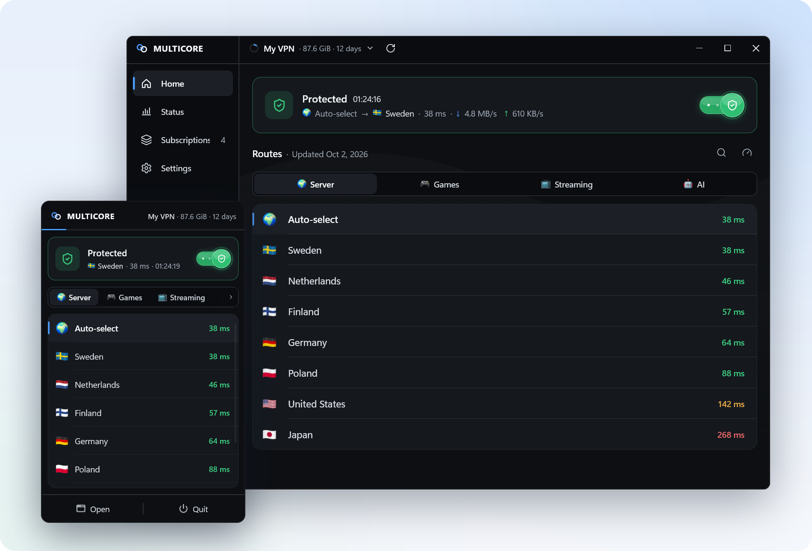
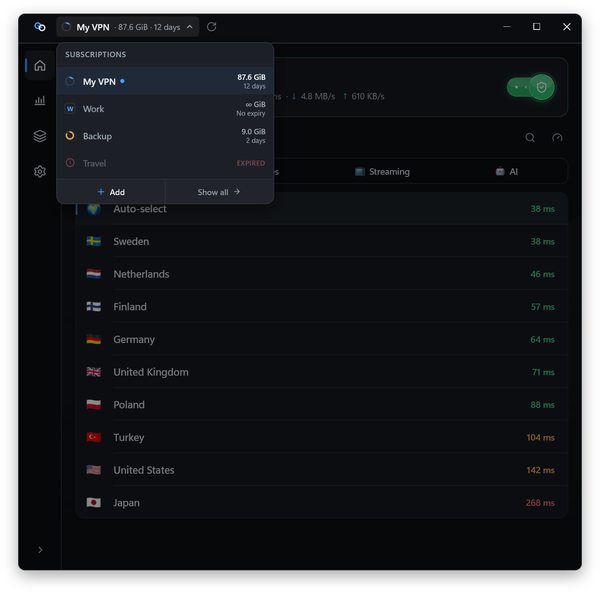
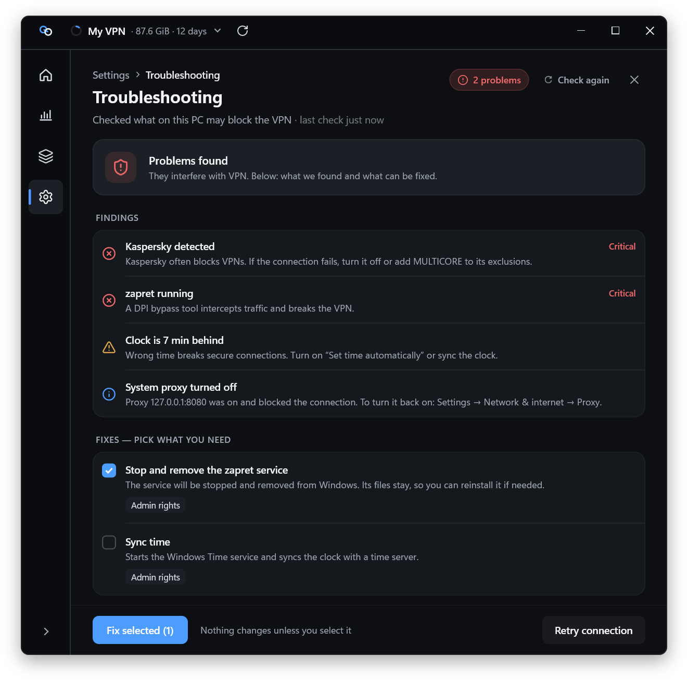
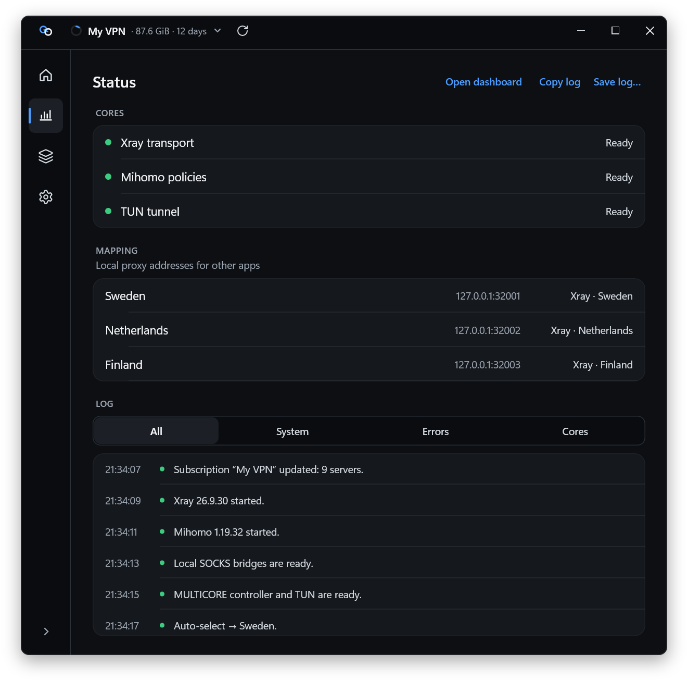
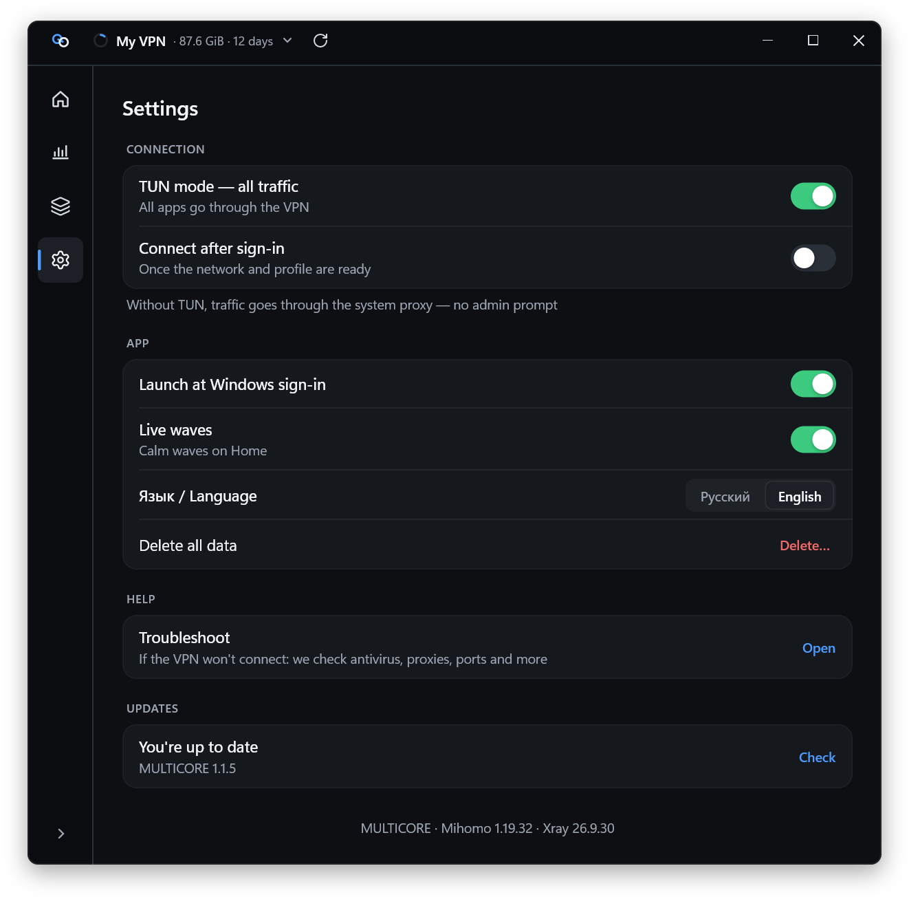
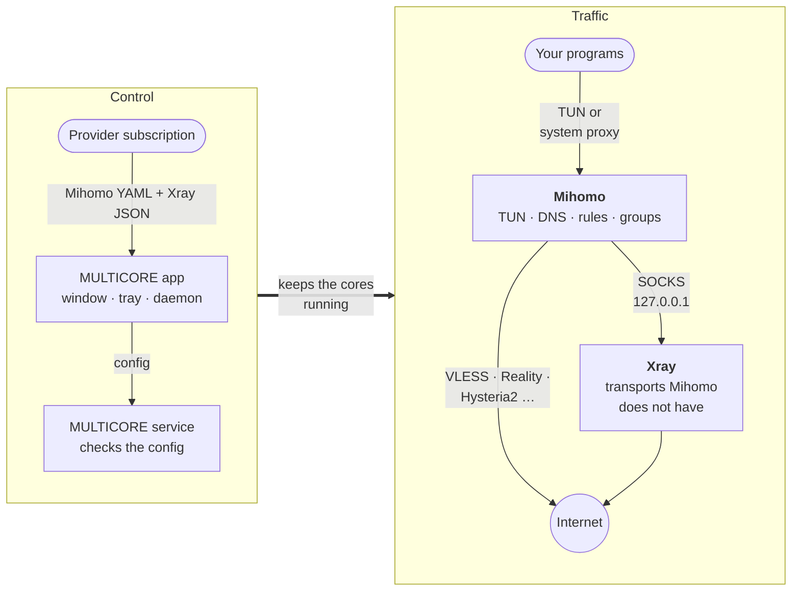

<p align="right"><a href="README.md">Русский</a> · <b>English</b></p>

<p align="center">
  <picture>
    <source media="(prefers-color-scheme: dark)" srcset="docs/assets/logo-dark.svg">
    
  </picture>
</p>

<h1 align="center">MULTICORE</h1>

<p align="center">
  <b>Two cores, Mihomo and Xray, behind one Connect button.</b><br>
  A native VPN client for Windows and Linux. Paste your subscription, press Connect, done.
</p>

<p align="center">
  <a href="https://github.com/fatyzzz/multicore-releases/releases/latest"></a>
  
  
  
</p>

<p align="center">
  <a href="#download"><b>Download</b></a> ·
  <a href="#features">Features</a> ·
  <a href="#how-it-works">How it works</a> ·
  <a href="#for-providers">For providers</a> ·
  <a href="#faq">FAQ</a>
</p>

<p align="center">
  <picture>
    <source media="(prefers-color-scheme: dark)" srcset="docs/assets/hero-dark-en.png">
    
  </picture>
</p>

> [!NOTE]
> The app speaks English and Russian (Settings → Language; by default it follows your system). Screenshots show the English interface.

## Download

<table>
  <tr>
    <th align="left">System</th>
    <th>Installer&nbsp;<sub>recommended</sub></th>
    <th>Portable</th>
  </tr>
  <tr>
    <td><b>Windows 10/11 · x64</b><br><sub>almost every PC and laptop</sub></td>
    <td align="center"><a href="https://github.com/fatyzzz/multicore-releases/releases/latest/download/MultiCore-Setup-x64.exe"></a></td>
    <td align="center"><a href="https://github.com/fatyzzz/multicore-releases/releases/latest/download/multicore-windows-x64.zip"></a></td>
  </tr>
  <tr>
    <td><b>Windows · x86</b><br><sub>32-bit Windows</sub></td>
    <td align="center"><a href="https://github.com/fatyzzz/multicore-releases/releases/latest/download/MultiCore-Setup-x86.exe"></a></td>
    <td align="center"><a href="https://github.com/fatyzzz/multicore-releases/releases/latest/download/multicore-windows-x86.zip"></a></td>
  </tr>
  <tr>
    <td><b>Windows · ARM64</b>&nbsp;<sup>beta</sup><br><sub>Snapdragon and other ARM laptops</sub></td>
    <td align="center"><a href="https://github.com/fatyzzz/multicore-releases/releases/latest/download/MultiCore-Setup-arm64.exe"></a></td>
    <td align="center"><a href="https://github.com/fatyzzz/multicore-releases/releases/latest/download/multicore-windows-arm64.zip"></a></td>
  </tr>
  <tr>
    <td><b>Linux · x86_64</b><br><sub>packages install the service</sub></td>
    <td align="center" colspan="2">
      <a href="https://github.com/fatyzzz/multicore-releases/releases/latest"></a>
      <a href="https://github.com/fatyzzz/multicore-releases/releases/latest"></a>
      <a href="https://github.com/fatyzzz/multicore-releases/releases/latest"></a>
      <a href="https://github.com/fatyzzz/multicore-releases/releases/latest"></a>
    </td>
  </tr>
</table>

The Windows buttons download straight from the [latest release](https://github.com/fatyzzz/multicore-releases/releases/latest). Linux file names carry the version number, so those buttons open the release page, which also has `RELEASE-SHA256SUMS.txt` and the core sources.

> [!WARNING]
> The builds are **not code-signed** yet, so SmartScreen may warn about an unknown publisher on first run: "More info" → "Run anyway". You can check the file against its [SHA-256](#verify-downloads).

## Features

- **Instant connect.** With the MULTICORE service the cores stay ready while the app is open. Connecting and disconnecting take a fraction of a second and never ask for admin rights. Latency and the real node behind Auto-select show up before you connect.
- **Two cores, one button.** Mihomo handles TUN, DNS, rules and groups. Xray carries transports Mihomo lacks. Your provider supplies servers and rules; there is nothing to configure.
- **Traffic and expiry at a glance.** A usage ring and "87.6 GiB · 12 days" in the title bar, remaining traffic in the tray too. Up to 16 subscriptions, one-click switching, auto-refresh on the provider's interval.
- **Routes you can read.** Provider groups as tabs, colour-coded latency, search across all groups (<kbd>Ctrl</kbd>+<kbd>F</kbd>), right-click a node to re-measure just that one.
- **Troubleshooter.** Finds what breaks VPN: antivirus, DPI tools, busy ports, a foreign proxy, Discord Drover, hosts, policies, clock. It only fixes what you tick. "Save log…" builds a ZIP for support with subscription links and keys stripped.
- **Verified updates.** New versions download while the VPN keeps running, are checked by SHA-256 and installed whole, with rollback if anything fails.
- **TUN or system proxy.** TUN routes all traffic. On Windows, proxy mode uses the system proxy and needs no admin rights at all.
- **Native and light.** Rust and Slint, no Electron or WebView. The Skia renderer (Direct3D 12 on Windows) keeps text sharp at any scale.

<table>
  <tr>
    <td width="50%"></td>
    <td width="50%"></td>
  </tr>
  <tr>
    <td></td>
    <td></td>
  </tr>
</table>

## How it works



The service starts both cores ahead of time and accepts a config only after strict sanitising: no file paths, extra ports or risky features. Connect just switches on TUN (or the system proxy) on the already running Mihomo, which is why it is instant. Without the service, a `multicore-core-host` process with admin rights does the same job at connect time. If every server is native to Mihomo (for example, Remnawave subscriptions), Xray simply idles. Details: [how MULTICORE works (RU)](docs/how-it-works.md).

## Install

**Windows.** The installer asks for a mode on its first screen:

- **With the service (recommended):** one admin prompt during setup, installs to `Program Files`, instant connect without UAC, updates install silently.
- **Without the service:** no admin rights, installs into your profile (`%LOCALAPPDATA%\Programs\MultiCore`). Proxy mode works without admin rights; TUN asks for UAC on every connect. You can add the service later in Settings.

The portable ZIP runs `MultiCore.exe` as is but does not register `multicore://` links.

**Linux.**

| Distribution | Install |
|---|---|
| Debian 12+, Ubuntu 22.04+ | `sudo apt install ./multicore_<version>_amd64.deb` |
| Fedora 43/44 | `sudo dnf install ./multicore-<version>-1.x86_64.rpm` |
| Arch Linux | `sudo pacman -U multicore-<version>-1-x86_64.pkg.tar.zst` |
| Any | `chmod +x MultiCore-*.AppImage && ./MultiCore-*.AppImage` |

The deb, rpm and Arch packages install and enable `multicore.service`, so connecting is instant and password-free. The AppImage runs without the service (polkit asks for a password on connect) and needs GTK 3, polkit and AppIndicator. The tray needs a StatusNotifierItem host: KDE, GNOME with the AppIndicator extension, waybar, XFCE, Cinnamon, MATE.

**Adding a subscription.** Copy the link and press "Paste from clipboard", type it in, or click "Add to MULTICORE" on your provider's page (a `multicore://add/https://…` link; the app shows the host and asks you to confirm).

> [!IMPORTANT]
> MULTICORE needs a subscription made for MULTICORE. Plain `vless://…` lists and base64 subscriptions do not work, and the app says so.

## For providers

MULTICORE requests the subscription with three User-Agents: `multicore-json-massive`, `multicore-mihomo` and `multicore-xray`. It understands `subscription-userinfo`, announcements, a service logo and support links. The `dumb-mode: on` header keeps a single route group in the app.

- [**llms-full.txt**](llms-full.txt): the complete subscription-server spec in English. Hand it to a developer or an LLM.
- [Provider contract (RU)](docs/providers.md): formats, request and response headers, device limits, the "Add to MULTICORE" button.
- [Remnawave in 5 minutes (RU)](docs/remnawave.md): one Mihomo template and two Response Rules, no panel patches. Ready-made files are in [`docs/remnawave`](docs/remnawave).

## Security and privacy

- **No data collection.** No accounts, telemetry, analytics or servers of our own. The app only talks to addresses from your subscription and to this repository for updates.
- **What your provider sees:** a stable device ID (`x-hwid`, for device limits), OS name and version, and device model. Never your user name, computer name or raw MachineGuid.
- **A locked-down service.** It runs only the cores from the protected install folder, sanitises every config and exposes Mihomo through a filtered controller. The dashboard is read-only: logs, rules, connections.
- **Links stay private.** Subscription links never reach logs or error messages.
- **Local data:** `%LOCALAPPDATA%\MultiCore` on Windows, `~/.local/share/multicore` on Linux.

### Verify downloads

Every release ships `RELEASE-SHA256SUMS.txt`:

```powershell
Get-FileHash .\MultiCore-Setup-x64.exe -Algorithm SHA256   # Windows
```

```sh
sha256sum -c --ignore-missing RELEASE-SHA256SUMS.txt       # Linux
```

## FAQ

<details>
<summary><b>The app says my subscription is not supported</b></summary>

<br>

Your provider does not serve a MULTICORE config yet. Point them to [llms-full.txt](llms-full.txt) or, for Remnawave panels, to the [Remnawave guide](docs/remnawave.md).

</details>

<details>
<summary><b>The VPN does not connect</b></summary>

<br>

Open Settings → «Устранить неполадки» (Troubleshoot). It looks for the usual culprits and also offers to reinstall Wintun or the service. If that does not help, press «Сохранить лог…» (Save log) on the «Состояние» (Status) page and attach the ZIP to an [issue](https://github.com/fatyzzz/multicore-releases/issues). Subscription links and keys are stripped from it.

</details>

<details>
<summary><b>Does it run on Windows ARM?</b></summary>

<br>

The ARM64 build ships since 1.1.3 as a beta: it has not been tested on real ARM hardware yet. Please report problems in [issues](https://github.com/fatyzzz/multicore-releases/issues).

</details>

<details>
<summary><b>How does it update?</b></summary>

<br>

MULTICORE checks this repository at startup and once a day. On Windows and in the AppImage it downloads, verifies and installs the update itself (with the service, without any prompt). For deb, rpm and Arch packages it only tells you, and you update with your package manager.

</details>

## Core licences and sources

Mihomo is GPL-3.0 and Xray-core is MPL-2.0. Every release includes the exact sources of the bundled cores (`mihomo-source.zip`, `Xray-core-source.zip`); licence texts and `THIRD_PARTY_NOTICES.md` ship inside the package.

<p align="center"><sub>This repository is the public release channel for MULTICORE: builds, checksums and docs. The app gets its updates from here.</sub></p>
