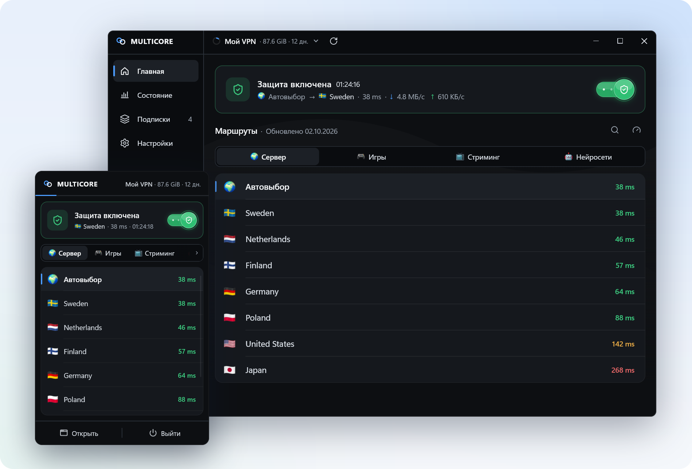
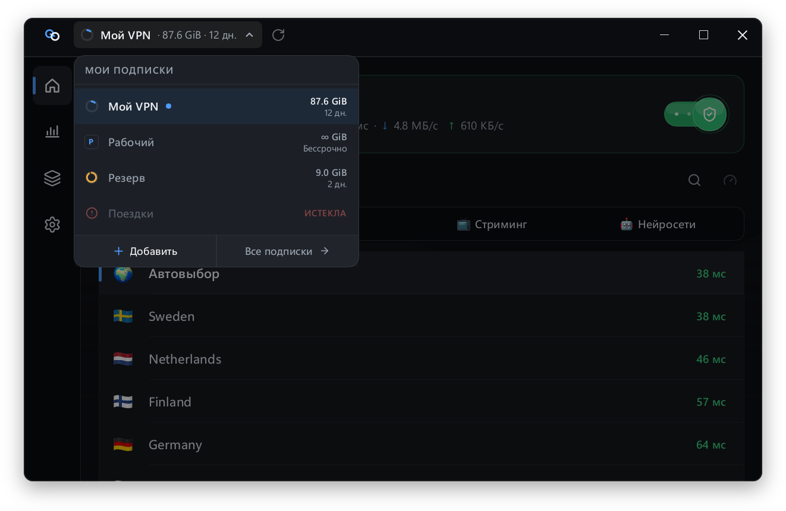
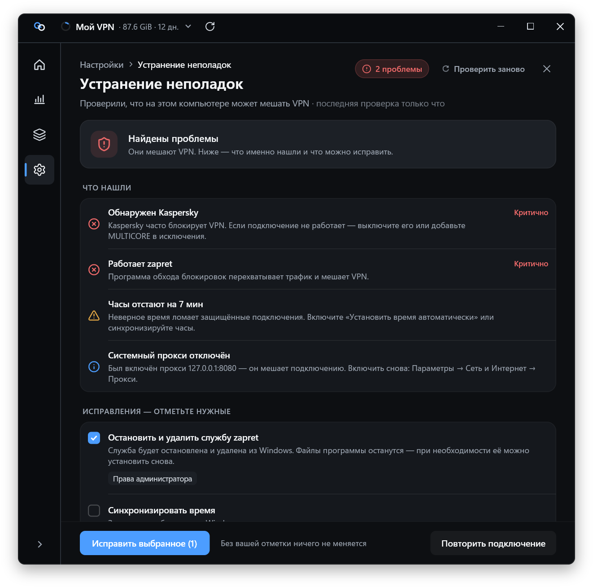
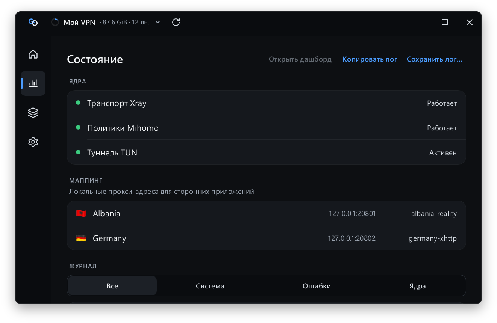
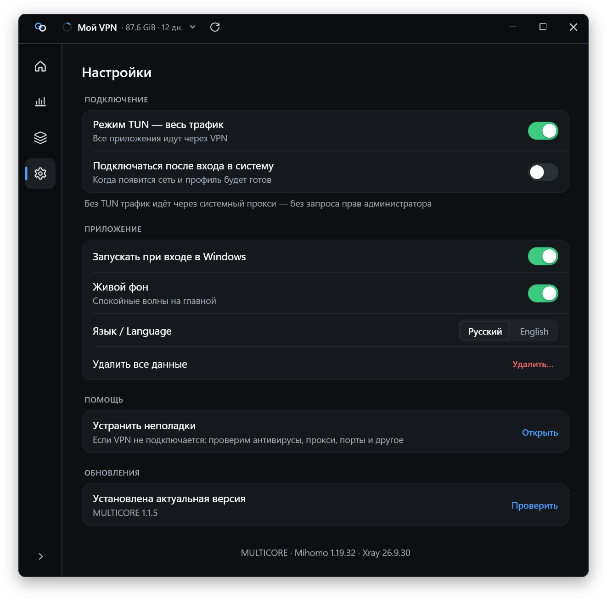
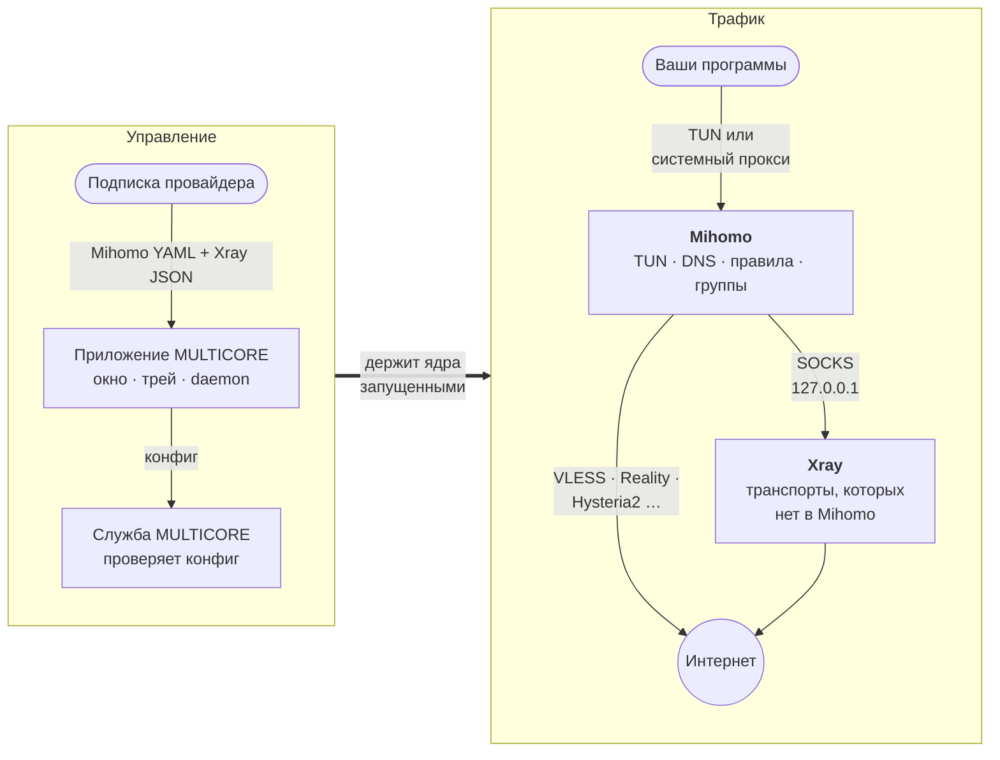

<p align="right"><b>Русский</b> · <a href="README.en.md">English</a></p>

<p align="center">
  <picture>
    <source media="(prefers-color-scheme: dark)" srcset="docs/assets/logo-dark.svg">
    
  </picture>
</p>

<h1 align="center">MULTICORE</h1>

<p align="center">
  <b>Два ядра — Mihomo и Xray — за одной кнопкой «Подключить».</b><br>
  Нативный VPN-клиент для Windows и Linux. Вставили подписку, нажали кнопку — работает.
</p>

<p align="center">
  <a href="https://github.com/fatyzzz/multicore-releases/releases/latest"></a>
  
  
  
</p>

<p align="center">
  <a href="#скачать"><b>Скачать</b></a> ·
  <a href="#возможности">Возможности</a> ·
  <a href="#как-это-работает">Как это работает</a> ·
  <a href="#провайдерам">Провайдерам</a> ·
  <a href="#вопросы-и-ответы">Вопросы</a>
</p>

<p align="center">
  <picture>
    <source media="(prefers-color-scheme: dark)" srcset="docs/assets/hero-dark.png">
    
  </picture>
</p>

## Скачать

<table>
  <tr>
    <th align="left">Система</th>
    <th>Установщик&nbsp;<sub>рекомендуется</sub></th>
    <th>Портативная&nbsp;версия</th>
  </tr>
  <tr>
    <td><b>Windows 10/11 · x64</b><br><sub>почти все ПК и ноутбуки</sub></td>
    <td align="center"><a href="https://github.com/fatyzzz/multicore-releases/releases/latest/download/MultiCore-Setup-x64.exe"></a></td>
    <td align="center"><a href="https://github.com/fatyzzz/multicore-releases/releases/latest/download/multicore-windows-x64.zip"></a></td>
  </tr>
  <tr>
    <td><b>Windows · x86</b><br><sub>32-битная Windows</sub></td>
    <td align="center"><a href="https://github.com/fatyzzz/multicore-releases/releases/latest/download/MultiCore-Setup-x86.exe"></a></td>
    <td align="center"><a href="https://github.com/fatyzzz/multicore-releases/releases/latest/download/multicore-windows-x86.zip"></a></td>
  </tr>
  <tr>
    <td><b>Windows · ARM64</b>&nbsp;<sup>beta</sup><br><sub>Snapdragon и другие ARM-ноутбуки</sub></td>
    <td align="center"><a href="https://github.com/fatyzzz/multicore-releases/releases/latest/download/MultiCore-Setup-arm64.exe"></a></td>
    <td align="center"><a href="https://github.com/fatyzzz/multicore-releases/releases/latest/download/multicore-windows-arm64.zip"></a></td>
  </tr>
  <tr>
    <td><b>Linux · x86_64</b><br><sub>пакеты ставят службу</sub></td>
    <td align="center" colspan="2">
      <a href="https://github.com/fatyzzz/multicore-releases/releases/latest"></a>
      <a href="https://github.com/fatyzzz/multicore-releases/releases/latest"></a>
      <a href="https://github.com/fatyzzz/multicore-releases/releases/latest"></a>
      <a href="https://github.com/fatyzzz/multicore-releases/releases/latest"></a>
    </td>
  </tr>
</table>

Кнопки Windows скачивают файл из [последнего релиза](https://github.com/fatyzzz/multicore-releases/releases/latest) напрямую. В именах Linux-пакетов есть номер версии, поэтому эти кнопки ведут на страницу релиза. Там же лежат `RELEASE-SHA256SUMS.txt` и исходники ядер.

> [!NOTE]
> Сборки пока **не подписаны** сертификатом, поэтому при первом запуске SmartScreen может предупредить о неизвестном издателе: «Подробнее» → «Выполнить в любом случае». Подлинность файла можно проверить по [SHA-256](#проверка-файлов).

## Возможности

<table>
  <tr>
    <td width="50%" valign="top">
      <h3>⚡ Мгновенное подключение</h3>
      <p>Со службой MULTICORE ядра готовы, пока открыто приложение. Подключение и отключение занимают доли секунды и не спрашивают права администратора. Пинги и реальный узел за «Автовыбором» видны ещё до подключения.</p>
    </td>
    <td width="50%" valign="top">
      <h3>🧩 Два ядра, одна кнопка</h3>
      <p>Mihomo отвечает за TUN, DNS, правила и группы. Xray везёт транспорты, которых в Mihomo нет. Подписку, правила и серверы задаёт провайдер, вам ничего настраивать не нужно.</p>
    </td>
  </tr>
  <tr>
    <td valign="top">
      <h3>📊 Трафик и срок на виду</h3>
      <p>Колечко расхода и остаток «87.6 GiB · 12 дн.» прямо в заголовке окна, остаток — и в трее. До 16 подписок, переключение в один клик, автообновление по интервалу провайдера.</p>
    </td>
    <td valign="top">
      <h3>🛰️ Маршруты как на ладони</h3>
      <p>Группы провайдера вкладками, пинг цветом, поиск по всем группам (<kbd>Ctrl</kbd>+<kbd>F</kbd>). Правый клик по узлу перемеряет пинг только его.</p>
    </td>
  </tr>
  <tr>
    <td valign="top">
      <h3>🩺 «Устранить неполадки»</h3>
      <p>Ищет, что мешает VPN: антивирусы, DPI-утилиты, занятые порты, чужой прокси, Discord Drover, hosts, политики, время. Исправляет только то, что вы отметили.</p>
    </td>
    <td valign="top">
      <h3>🔄 Обновления с проверкой</h3>
      <p>Новая версия скачивается, пока VPN работает, проверяется по SHA-256 и ставится целиком. Если что-то пошло не так, программа откатывается на прежнюю версию.</p>
    </td>
  </tr>
  <tr>
    <td valign="top">
      <h3>🔀 TUN или системный прокси</h3>
      <p>TUN пускает через VPN весь трафик. Режим без TUN на Windows работает через системный прокси и абсолютно без прав администратора.</p>
    </td>
    <td valign="top">
      <h3>🪶 Нативный и лёгкий</h3>
      <p>Rust и Slint, без Electron и WebView. Рендерер Skia (на Windows — Direct3D 12) даёт чёткий текст при любом масштабе. Трей можно растянуть, размер запоминается.</p>
    </td>
  </tr>
</table>

<table>
  <tr>
    <td width="50%"></td>
    <td width="50%"></td>
  </tr>
  <tr>
    <td align="center"><sub><b>Подписки</b> · остаток трафика и дней у каждой</sub></td>
    <td align="center"><sub><b>Устранение неполадок</b> · без вашей галочки ничего не меняется</sub></td>
  </tr>
  <tr>
    <td></td>
    <td></td>
  </tr>
  <tr>
    <td align="center"><sub><b>Состояние</b> · ядра, мосты в Xray, журнал и «Сохранить лог…»</sub></td>
    <td align="center"><sub><b>Настройки</b> · TUN, автозапуск, обновления</sub></td>
  </tr>
</table>

## Как это работает



1. **Подписка.** MULTICORE запрашивает у провайдера конфиги Mihomo и Xray по одной ссылке. Если серверы умеет сам Mihomo (например, подписки из Remnawave), Xray просто стоит без дела.
2. **Служба.** Запускает оба ядра заранее и принимает конфиг только после строгой очистки: никаких путей к файлам, лишних портов и опасных функций. Без службы ту же работу при подключении делает процесс `multicore-core-host` с правами администратора.
3. **Подключение.** «Подключить» лишь включает TUN у уже работающего Mihomo или системный прокси. Поэтому это мгновенно и без UAC.
4. **Маршрутизация.** Mihomo решает по правилам провайдера, куда идёт трафик. Серверы, которых он не умеет, он передаёт в Xray через локальный SOCKS-мост.

Подробно, со всеми деталями про права и файлы: [Как устроен MULTICORE](docs/how-it-works.md).

## Установка

<details open>
<summary><b>Windows: со службой или без</b></summary>

<br>

На первом экране установщик спросит режим:

| | Со службой (рекомендуется) | Без службы |
|---|---|---|
| Права администратора | один раз, при установке | для TUN — при каждом подключении |
| Куда ставится | `Program Files` | профиль пользователя (`%LOCALAPPDATA%\Programs\MultiCore`) |
| Подключение | мгновенное, без UAC | ядра стартуют при подключении, нужен UAC |
| Обновления | ставит служба, без запросов | ставит приложение |

Режим без TUN (системный прокси) работает без прав администратора в обоих вариантах. Службу можно доустановить позже: Настройки → «Мгновенное подключение».

Ставьте программу из-под учётной записи администратора. Портативный архив распакуйте и запустите `MultiCore.exe`, но ссылки `multicore://` он не регистрирует.

</details>

<details>
<summary><b>Linux: deb, rpm, Arch, AppImage</b></summary>

<br>

| Дистрибутив | Файл | Установка |
|---|---|---|
| Debian 12+, Ubuntu 22.04+ | `multicore_<версия>_amd64.deb` | `sudo apt install ./multicore_<версия>_amd64.deb` |
| Fedora 43/44 | `multicore-<версия>-1.x86_64.rpm` | `sudo dnf install ./multicore-<версия>-1.x86_64.rpm` |
| Arch Linux | `multicore-<версия>-1-x86_64.pkg.tar.zst` | `sudo pacman -U multicore-<версия>-1-x86_64.pkg.tar.zst` |
| Любой | `MultiCore-<версия>-x86_64.AppImage` | `chmod +x MultiCore-*.AppImage && ./MultiCore-*.AppImage` |

- **Служба.** Пакеты deb, rpm и Arch ставят и включают `multicore.service`: подключение мгновенное и без пароля. AppImage работает без службы, пароль при подключении спрашивает polkit.
- **Трей.** Нужен StatusNotifierItem: KDE, GNOME с расширением AppIndicator, waybar, XFCE, Cinnamon, MATE.
- **AppImage.** Нужны GTK 3, polkit и AppIndicator. Ссылки `multicore://` он не регистрирует, для кнопок «Добавить в MULTICORE» ставьте пакет.

</details>

### Как добавить подписку

- **Вставить из буфера.** Скопируйте ссылку и нажмите «Вставить из буфера».
- **Вручную.** Введите ссылку в поле подписки.
- **Кнопкой провайдера.** Нажмите «Добавить в MULTICORE» на странице подписки (ссылка вида `multicore://add/https://…`). Приложение покажет, с какого хоста пришла подписка, и спросит подтверждение.

> [!IMPORTANT]
> MULTICORE читает не любую подписку: провайдер должен отдавать конфиг для MULTICORE. Списки `vless://…` и base64-подписки не подходят. Если провайдер его не поддерживает, приложение так и скажет.

## Провайдерам

MULTICORE запрашивает подписку тремя User-Agent: `multicore-json-massive`, `multicore-mihomo` и `multicore-xray`. Понимает `subscription-userinfo`, анонсы, логотип сервиса, ссылки на поддержку и личный кабинет. Заголовок `dumb-mode: on` оставляет в приложении одну группу маршрутов.

<table>
  <tr>
    <td width="50%" valign="top">📘&nbsp;<a href="docs/providers.md"><b>Подписка для MULTICORE</b></a><br><sub>Форматы, заголовки запроса и ответа, лимит устройств, кнопка «Добавить в MULTICORE»</sub></td>
    <td width="50%" valign="top">🌊&nbsp;<a href="docs/remnawave.md"><b>Remnawave за 5 минут</b></a><br><sub>Один шаблон Mihomo и два Response Rules, панель патчить не нужно. Готовые файлы — в <a href="docs/remnawave">docs/remnawave</a></sub></td>
  </tr>
  <tr>
    <td valign="top">🤖&nbsp;<a href="llms-full.txt"><b>llms-full.txt</b></a><br><sub>Полная спецификация сабсервера на английском: отдайте её разработчику или нейросети</sub></td>
    <td valign="top">⚙️&nbsp;<a href="docs/how-it-works.md"><b>Как устроен MULTICORE</b></a><br><sub>Почему два ядра, что делает служба, где лежат файлы</sub></td>
  </tr>
</table>

## Безопасность и приватность

- **Ничего не собираем.** У проекта нет аккаунтов, телеметрии, аналитики и своих серверов. Приложение ходит только по адресам из вашей подписки и в этот репозиторий за обновлениями.
- **Что видит провайдер.** Стабильный идентификатор устройства (`x-hwid`, нужен для лимита устройств), ОС, её версию и модель устройства. Имя пользователя, имя компьютера и исходный MachineGuid не передаются.
- **Служба под замком.** Запускает только ядра из защищённой папки установки и принимает конфиг после строгой очистки. Управление Mihomo идёт через фильтрованный контроллер, а дашборд открывается только на просмотр: логи, правила, соединения.
- **Ссылки не утекают.** Ссылки подписок не попадают ни в логи, ни в тексты ошибок. Из архива «Сохранить лог…» ссылки и ключи вырезаются.
- **Сеть без сюрпризов.** HTTPS нельзя понизить до HTTP редиректом, а публичный адрес не может перенаправить запрос в локальную сеть.
- **Данные у вас.** Подписки и настройки хранятся локально: `%LOCALAPPDATA%\MultiCore` на Windows, `~/.local/share/multicore` на Linux.

### Проверка файлов

В каждом релизе есть `RELEASE-SHA256SUMS.txt`.

```powershell
# Windows
Get-FileHash .\MultiCore-Setup-x64.exe -Algorithm SHA256
```

```sh
# Linux
sha256sum -c --ignore-missing RELEASE-SHA256SUMS.txt
```

## Вопросы и ответы

<details>
<summary><b>Приложение пишет, что подписка не подходит. Что делать?</b></summary>

<br>

Значит, провайдер не отдаёт конфиг для MULTICORE: обычные списки `vless://…` и base64-подписки клиент не читает. Попросите провайдера добавить поддержку и дайте ему ссылку на [документацию для провайдеров](docs/providers.md). Для панелей Remnawave есть [готовая инструкция](docs/remnawave.md).

</details>

<details>
<summary><b>VPN не подключается</b></summary>

<br>

Откройте Настройки → «Устранить неполадки». Проверка найдёт типичные помехи (антивирусы, DPI-утилиты, занятые порты, чужой прокси, Discord Drover) и предложит исправления. Там же есть «Переустановить Wintun» и «Переустановить службу». Если не помогло, нажмите «Сохранить лог…» на вкладке «Состояние» и приложите архив к [issue](https://github.com/fatyzzz/multicore-releases/issues). Ссылки подписок и ключи из архива вырезаются.

</details>

<details>
<summary><b>Windows Defender или SmartScreen ругается на установщик</b></summary>

<br>

Сборки пока не подписаны сертификатом, поэтому SmartScreen не знает издателя. Сверьте SHA-256 файла с `RELEASE-SHA256SUMS.txt` из релиза, затем «Подробнее» → «Выполнить в любом случае».

</details>

<details>
<summary><b>Зачем два ядра?</b></summary>

<br>

У Mihomo лучший движок маршрутизации: TUN, DNS с fake-ip, правила по доменам, IP и процессам, группы с автовыбором. Xray раньше всех получает новые транспорты и способы маскировки, и некоторых из них в Mihomo нет вовсе. MULTICORE запускает оба и связывает их локальными SOCKS-мостами, так что провайдер может использовать сильные стороны каждого.

</details>

<details>
<summary><b>Что пойдёт через VPN в режиме без TUN?</b></summary>

<br>

Только программы, которые уважают системный прокси: браузеры и большинство приложений. Игры, торренты и консольные утилиты обычно пойдут напрямую. Если нужно пустить через VPN всё, включите «Режим TUN — весь трафик».

</details>

<details>
<summary><b>Работает ли на Windows ARM?</b></summary>

<br>

Сборка для ARM64 выходит с версии 1.1.3 и пока в статусе beta: на реальном ARM-железе её ещё не проверяли. Если что-то не так, напишите в [issues](https://github.com/fatyzzz/multicore-releases/issues).

</details>

<details>
<summary><b>Как обновляется приложение?</b></summary>

<br>

MULTICORE проверяет этот репозиторий при запуске и примерно раз в час. На Windows и в AppImage обновление скачивается, сверяется по SHA-256 и ставится само, со службой — без запроса прав. Пакеты deb, rpm и Arch обновляйте пакетным менеджером, приложение только сообщит о новой версии.

</details>

<details>
<summary><b>Как удалить полностью?</b></summary>

<br>

Удалите программу как обычно. Подписки и настройки при этом остаются, чтобы их не потерять при переустановке. Чтобы стереть и их, после выхода из приложения удалите папку данных: `%LOCALAPPDATA%\MultiCore` на Windows или `~/.local/share/multicore` на Linux. Ещё проще — Настройки → «Удалить все данные».

</details>

## Лицензии ядер и исходники

Mihomo распространяется по GPL-3.0, Xray-core — по MPL-2.0. Исходники ровно тех версий ядер, что лежат в сборке, приложены к каждому релизу: `mihomo-source.zip` и `Xray-core-source.zip`. Тексты лицензий ядер и `THIRD_PARTY_NOTICES.md` лежат внутри пакета.

## Благодарности

Отдельное спасибо [@bolivkazelenayau](https://github.com/bolivkazelenayau) за помощь с UX/UI.

<p align="center"><sub>Этот репозиторий — публичный канал релизов MULTICORE: сборки, контрольные суммы и документация. Отсюда же приложение получает обновления.</sub></p>
